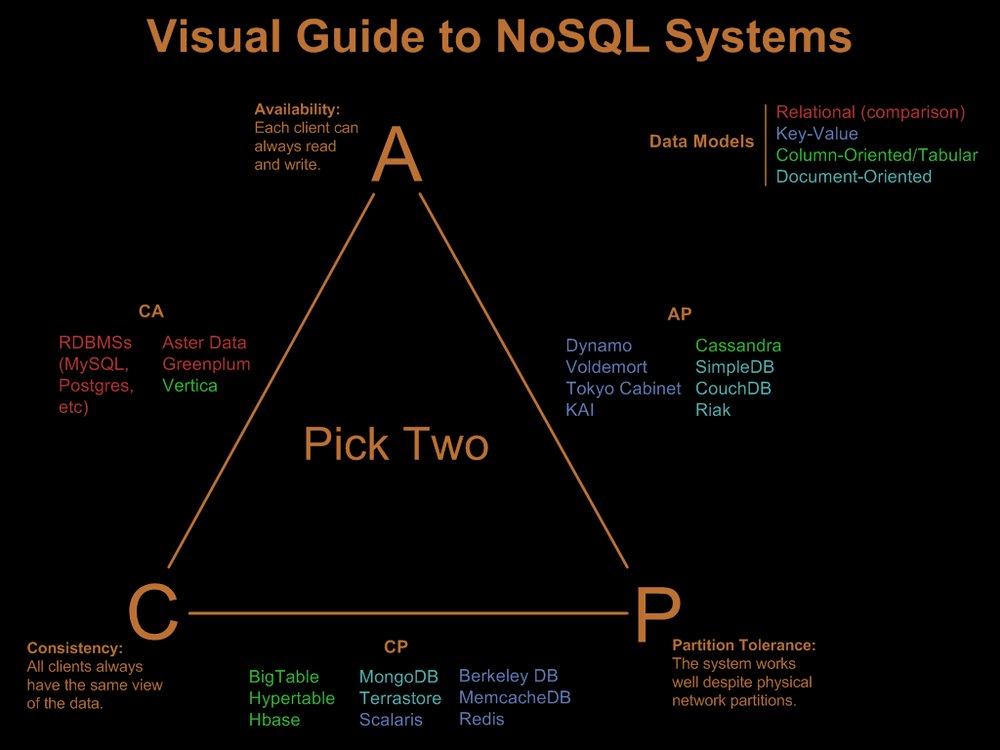

# 11-1 Firebase 資料庫簡介

### 11-1-1 NoSQL 資料庫觀念

1. 資料主體是資料項，每筆資料皆是`key-value`對應關係。
2. 資料庫類型
   1. **Wide Column Store / Column Families**
   2. **Document Store**
   3. **Key Value / Tuple Store**
   4. **Graph Database Management Systems**
   5. **Multimodel Database Management Systems**
   6. \*\*\*\*

### RDBMS 與 NoSQL 差異

|  | RDBMS | NoSQL |
| :--- | :--- | :--- |
| 資料相依性 | 關聯式 | 狀態性 |
| 應用面 | 高邏輯 | 非邏輯 |
| 擴充性 | 垂直擴充 | 水平擴充 |
| 理論性目標 | ACID | CAP |

### CAP 理論概要

CAP 定義如下：  
C: _**Consistency 一致性**_  
A: _**Availability 可用性**_  
P: _**Partition Tolerance分區容錯性**_

CAP理論的核心是：一個分布式系統不可能同時很好的滿足一致性，可用性和分區容錯性這三個需求，最多只能同時較好的滿足兩個。

> NoSQL 受到CAP理論的約束，不可能達到高一致性，高可用性，高分區容錯性的完美設計。所以我們在設計的時候要懂得取舍，重點關注對應用需求來說比較重要的，而放棄不重要的，在CAP這三者之間進行取舍，設計出貼合應用的存儲方案。  
> [資料轉載\來源連結](http://myblog-maurice.blogspot.com/2012/08/nosqlcap.html)



#### 轉載文章：換 NoSQL 前的建議...

文章[來源連結](https://blog.gslin.org/archives/2013/02/27/3223/%E6%8F%9B-nosql-%E5%89%8D%E7%9A%84%E5%BB%BA%E8%AD%B0/)  
重點摘要：

1. 其實 SQL 可以解決大部分的事情，大家都知道 SQL 的瓶頸在哪裡，有哪些 workaround 可以避開。
2. 不要因為 [MySQL](http://dev.mysql.com/) 做不到就覺得 SQL 不好用，在這種情況下，[PostgreSQL](http://www.postgresql.org/) 的功能與成熟度很值得看看。
3. 不要用 [Oracle](http://www.oracle.com/) 官方版本的 MySQL... XD
4. 通常可以用 cache 解決的就用 cache 試著解看看，雖然 invalidate 問題不太好處哩... XD
5. 如果是 Read 數量太多，可以用 replication 解決不少問題。
6. 試著去理解 index 的「原理」，也就是資料結構，這對於要怎麼用 index 絕對有強力的幫助。
7. 當上面都做完而發現還是不夠的時候就 sharding 吧。

### 課本實做筆記

```bash
pip install requests==1.1.0
pip install python-firebase

如果不小心安裝到 requests 2.x.x 版本，會出現很多模組匯入失敗，進而需要安裝下列模組
pip install requests
pip install python-jwt
pip install gcloud
pip install sseclient
pip install pycrypto
pip install cryptography
pip install requests-toolbelt

但即使安裝上述模組，最終仍會出現下列錯誤：

Traceback (most recent call last):
  File "11-1.py", line 4, in <module>
    from firebase import firebase
ImportError: cannot import name firebase
```


debug 筆記

出現錯誤1: python 2.7

```python
Traceback (most recent call last):
  File "11-2.py", line 4, in <module>
    from firebase import firebase
  File "/usr/local/lib/python2.7/site-packages/firebase/__init__.py", line 22, in <module>
    from urllib.parse import urlencode, quote
ImportError: No module named parse
```

解法

```python
修改 File "/usr/local/lib/python2.7/site-packages/firebase/__init__.py", line 22, in <module>
第22行
from urllib.parse import urlencode, quote

修改如
""
# from urllib.parse import urlencode, quote
try:
    from urllib.parse import urlencode, quote
except:
    from urllib import urlencode, quote
""
```

出現錯誤2: python 3.8

```python
Traceback (most recent call last):
  File "11-2.py", line 4, in <module>
    from firebase import firebase
  File "/Users/afu/Library/Python/3.8/lib/python/site-packages/firebase/__init__.py", line 3
    from .async import process_pool
          ^
SyntaxError: invalid syntax
```

解法

```python
cd /Users/afu/Library/Python/3.8/lib/python/site-packages/firebase/
cp async.py async2.py
vi __init__.py
vi firebase.py

```

