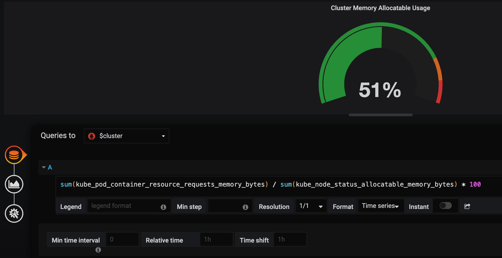

# Grafana收集Kubernetes系統資訊

前面篇文提到Prometheus與Grafana用途，這篇來說說實際上如何收集Kubernetes上面的系統資訊\(metric\)。

環境準備

* 先準備好K8s叢集環境，下列以GKE環境作為範例說明\(GKE起始叢集過程省略\)
* 安裝Prometheus，有關安裝方式，可參考[此篇](https://app.gitbook.com/@fufu/s/kk8s/~/drafts/-LpxQCUINCwdIigxPmJi/primary/task-memory/10.troubleshooting-prometheus#shi-yong-helm-an-zhuang-geng-xin-prometheus)內容。
* 安裝Grafana與整合Prometheus，下列開始介紹

### 安裝Grafana

如果您有使用Istio，可以直接在HELM Istio values.yaml中直接啟用即可。

```yaml
# addon grafana configuration
#
grafana:
  enabled: true
```

另一個方式，透過HELM stable安裝Grafana，詳細細節可參考[此篇文件](https://github.com/helm/charts/tree/master/stable/grafana)

```bash
helm install --name my-grafana stable/grafana -f values.yaml
```

### 收集Prometheus

登入**Grafana**，首先設定`data sources`，選擇 **sources type: Prometheus**

* Name：自訂
* URL：設定`Prometheus`的服務位址 


### 套用Dashboard

我在Grafana官網上找此[Dashboard id:8685](https://grafana.com/grafana/dashboards/8685)來套用。  
點選畫面左上角**＋**符號`Import`功能，右邊 **Grafana.com Dashboard** 欄位中輸入`8685`即可匯入。


如下圖（圖片來自官方網頁資訊），如果你環境中有多個 **K8s** 叢集環境，左上角還可以點選不同`Data sources`（當然你需要事先增加`data sources`）。


### 修改Panels

如果個別`Panels`資訊異常，例如沒有顯示，可以點選編輯。


修改與驗證裡頭的`PromQL`查詢語法，如對`PromQL`裡頭有哪些`Metric`項目可用，可以同時訪問 **Prometheus** 資訊頁面



#### Prometheus資訊頁面

開啟網址頁面如下，例如輸入關鍵字`memory`，就會顯示相關`Metric`項目


#### PromQL function

官網 [**此連結**](https://prometheus.io/docs/prometheus/latest/querying/functions/) ****有說明各種`function`如何應用於`PromQL`查詢語言中，經過查詢與計算後，即可將`Metric`數據顯示出來。

以上，大約簡略說明如何透過`Prometheus`以及`Grafana`，將運行 **K8s** 裡頭的`Metric`數據呈現出來，可供團隊了解環境的運作數據，進而幫助到團隊營運。

