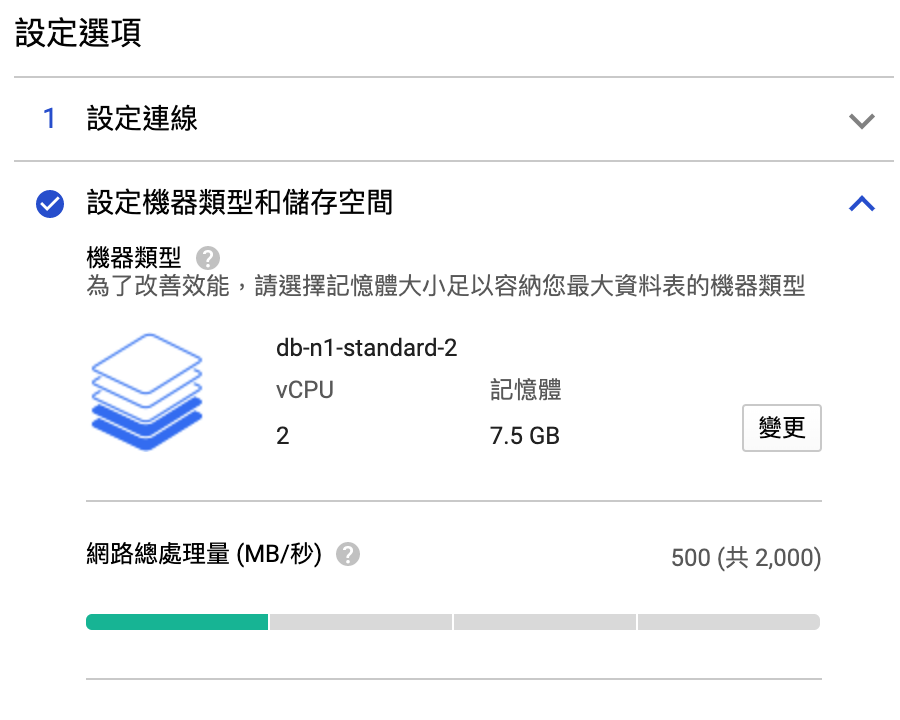
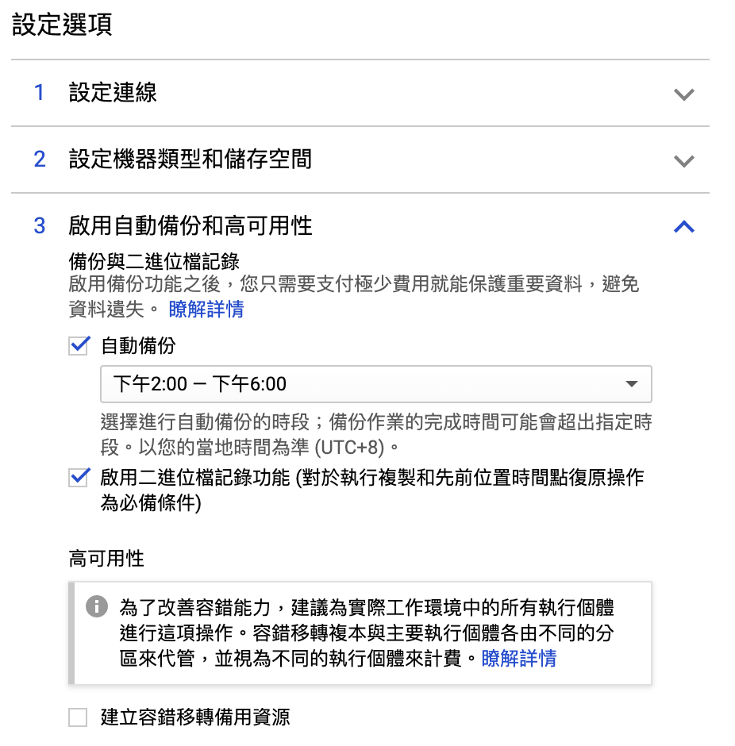
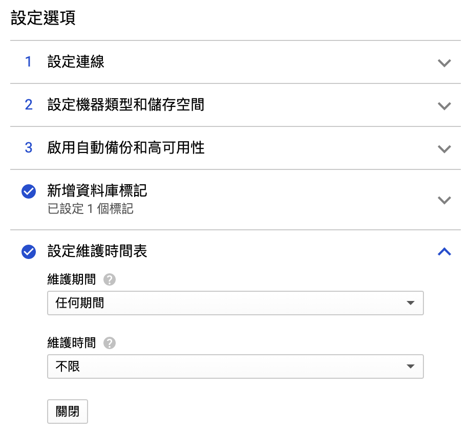

# GCP Cloud SQL 服務介紹

如同前兩篇提到的 Memorystore Redis 服務代管業務，`Cloud SQL` 就是 GCP 上關聯式資料庫的服務代管業務。  
目前此業務，有兩種資料庫可以選：`MySQL、PostgreSQL`

> 因為我個人僅使用過`MySQL`項目，以下僅以`MySQL`作為說明。

## 建立 MySQL 執行個體

建立MySQL執行個體，除了必要的root密碼之外，重要的`位置`不可挑錯，原則上是與您的應用服務相同**區域**與**分區**。  
關於資料庫版本，目前僅支援`5.6`與`5.7`兩種選擇，尚未支援`MySQL 8.0`版本。

## 設定選項\(重點說明）

### 1. 設定連線

如下兩張圖所示，連線可分為`私人IP、公開IP`，這與前篇 **Memorystore** 連線IP僅局限內網`10.0.0.0/8`有所不同。

> 關於`私人IP`選單中的`關聯網路` 其中的細節牽涉到GCP網路功能：VPC 網路  
> 會於另外一篇文章中說明。

設定了`私人IP`有其用處的，可讓您的應用服務與資料庫之間的資料交易，無需暴露在公網上。

勾選`公開IP`是預設選項，也可以取消勾選僅使用`私有IP`網路服務。  
當勾選使用`公開IP`時，是需要再設定允許進行資料交易的`已授權的網路`\(來源IP\)，否則仍是無法完成資料庫連線。

> 圖片中`0.0.0.0/0`是額外手動設定的，並非預設設定。

### 2. 機器類型與儲存空間

#### 機器類型、網路總處理量

機器類型依照需求選擇，有最小類型\(1核心CPU、1GB Memory\) 至最大類型 \(64核心CPU、416GB Memory\)等類型給予選擇。  
**重點：選擇不同類型，會有不同的`網路總處理量！`**這在評估需求時要特別注意。

#### 儲存空間類型、容量

這裡提到儲存空間的`類型`與`容量`，如下圖所示。  
`類型`與`容量`當然依照需求而選擇，重點是：容量選擇後只能擴充，無法減少 \(少部分情況，您會期望空間縮小減少成本\)。  
勾選`啟用自動增加儲存空間`，GCP 線上即會偵測剩餘空間，如果剩餘空間小於臨界值，即會自動擴充空間，擴充空間=臨界值，關於臨界值算法如下：

1. 最大臨界值 = `25GB`
2. 臨界值算法：`5 + (provisioned storage)/25`
3. 上述公式，意即`> 500GB`空間容量的臨界值固定為 25GB。

#### 關於 磁碟總處理量

前面提到選擇了機器類型、儲存類型與空間大小後，會影響著**`磁碟總處理量數據`上限**、**可用量\(綠色條\)**，此部分不得不注意，免得需求評估錯誤產生了效能瓶頸。

關於`磁碟總處理量數據`的官方說明如下所示：

### 3. 自動備份和高可用性

### 4. 資料庫標記

資料庫標記功能，如同`my.cnf`裡頭的參數設定，舉凡常見的`binlog、innodb、slow_query_log、time_out`等等參數，皆可在此標記中設定，啟用。

### 5. 維護時間

在預設的一小時的維護期間中，執行個體會自動重新啟動以套用更新。  
系統每隔數個月會執行一次更新。  
如果都沒有改過參數設定，是否就無維護，目前倒是不確定。

我的實務經驗中，因為`Cloud SQL`服務會久久隨機時段進行維護，在短短的維護作業中，會重新啟動執行個體，意即會造成應用服務無法向`Cloud SQL`服務進行資料交易行為 \(中斷連線約略數秒\)，目前所知此維護機制是無法避免的。  
故，在系統服務的適當時段中，選擇了合適的`期間`與`時間`，我的看法是有必要的。

### 6. 新增標籤

標籤主要是用於管理執行個體。  
舉例說，可以依環境、應用服務將標籤分門別類。標籤也會顯示在帳單中，方便瞭解每個環境\(標籤\)的成本情況。

以上，關於`Cloud SQL`服務大略說明至此。

